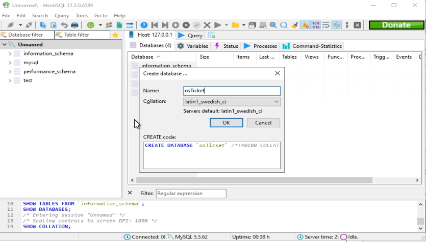

  

<h1>Implementing a Help Desk Ticketing System (osTicket) using Azure Virtual Machines</h1>
This tutorial outlines the prerequisites and installation of the open-source helpdesk ticketing system osTicket within Azure Virtual Machines. 

<h2>Environments and Technologies Used</h2>

- Microsoft Azure (Virtual Machines/Compute)
- Remote Desktop
- Internet Information Services (IIS)

<h2>Operating Systems Used </h2>

- Windows 10</b> (21H2)

<h2>List of Prerequisites</h2>

<ul>
<li>Microsoft Azure</li>
<li>Virtual Machine</li>
<li>osTicket Installation Files</li>
</ul>

<h2>Intial Install</h2>
<h3>Create the Azure Virtual Machine</h3>

Create the Azure VM with the following requirements below:

- Windows 10, 4 vCPUs
- Name: osticket-vm
- Username: labuser
- Password: osTicketPassword1!

<h3>Log into the Virtual Machine via Remote Desktop</h3>

<h3>Download the osTicket-Installation-Files.zip and unzip it onto your desktop.</h3>

[osTicket-Installation-Files.zip](https://drive.google.com/uc?export=download&id=1b3RBkXTLNGXbibeMuAynkfzdBC1NnqaD)

We will use the files in this folder to install osTicket and some of the dependencies.

 The folder should be called “osTicket-Installation-Files”>

<h3>Install and Enable IIS with CGI

Navigate to Control Panel --> Programs --> Programs and Features

Make sure to the following boxes are checked

<h4>You can test to see if this feature is working by going to your browser and typing 127.0.0.1

<h3>Install PHP Manager for IIS</h3>

From the “osTicket-Installation-Files” folder, install PHP Manager for IIS (PHPManagerForIIS_V1.5.0.msi)

<h3>Install the Rewrite Module</h3>

From the “osTicket-Installation-Files” folder install the Rewrite Module (rewrite_amd64_en-US.msi)

<h3>Create the PHP directory</h3>

Navigate to the system's C: drive and create a directory named "PHP"

<h3>Unzip PHP files into the folder</h3>

From the “osTicket-Installation-Files” folder, unzip PHP 7.3.8 (php-7.3.8-nts-Win32-VC15-x86.zip) into the “C:\PHP” folder

<h3>Install VC Redist Dependency</h3>

From the “osTicket-Installation-Files” folder, install VC_redist.x86.exe.

<h3>Install MySQL</h3>

From the “osTicket-Installation-Files” folder, install MySQL 5.5.62 (mysql-5.5.62-win32.msi)

- Typical Setup ->
- Launch Configuration Wizard (after install) ->
- Standard Configuration ->
- Username: root
- Password: root

<h3>Open IIS as an Admin</h3>

Type IIS Manager into the Search bar and open it as Administrator

<h3>Register PHP from within IIS</h3>

Click on PHP Manager and Register PHP (PHP Manager -> C:\PHP\php-cgi.exe)

<h3>Reload IIS (Open IIS, Stop and Start the server)</h3>

<h3>Install osTicket</h3>

- From the “osTicket-Installation-Files” folder, unzip “osTicket-v1.15.8.zip” 
- copy the “upload” folder into “c:\inetpub\wwwroot”
- Within “c:\inetpub\wwwroot”, Rename “upload” to “osTicket”

<h3>Reload IIS (Open IIS, Stop and Start the server)</h3>

<h3>Navigate to osTicket in IIS</h3>

Go to sites -> Default -> osTicket.  On the right, click “Browse *:80”

<h3>Enable required extensions for osTicket</h3>\

osTicket still requires some extensions that we need to enable in IIS

- Go back to IIS, sites -> Default -> osTicket
- Double-click PHP Manager
- Click “Enable or disable an extension”

  - Enable: php_imap.dll
  - Enable: php_intl.dll
  - Enable: php_opcache.dll

- Refresh the osTicket site in your browser, observe the changes

<h3>Finishing Touch</h3>

Rename: ost-config.php

- From: C:\inetpub\wwwroot\osTicket\include\ost-sampleconfig.php
- To: C:\inetpub\wwwroot\osTicket\include\ost-config.php

Assign Permissions: ost-config.php

- Disable inheritance -> Remove All
- New Permissions -> Everyone -> All

<h2>Intial osTicket Install</h2>
<h3>Continue Setting up osTicket in the browser</h3>

- Name Helpdesk
- Default email (receives email from customers)

Choose any name and email you want.

<h3>Install HeidiSQL</h3>

From the “osTicket-Installation-Files” folder, install HeidiSQL.

- Open Heidi SQL
- Create a new session, root/root
- Connect to the session

- Create a database called “osTicket”

<h3>Continue osTicket Setup</h3>

Continue Setting up osTicket in the browser

- MySQL Database: osTicket
- MySQL Username: root
- MySQL Password: root
- Click “Install Now!”

<h2> osTicket is now Installed</h2>
<h3>Congratulations, osTicket has now installed with (hopefully) no errors</h3>

- Login Page: http://localhost/osTicket/scp/login.php 
- End User Login Page: http://localhost/osTicket/ 

<h3>Clean Up</h3>

- Delete: C:\inetpub\wwwroot\osTicket\setup
- Set Permissions to “Read” only: C:\inetpub\wwwroot\osTicket\include\ost-config.php

